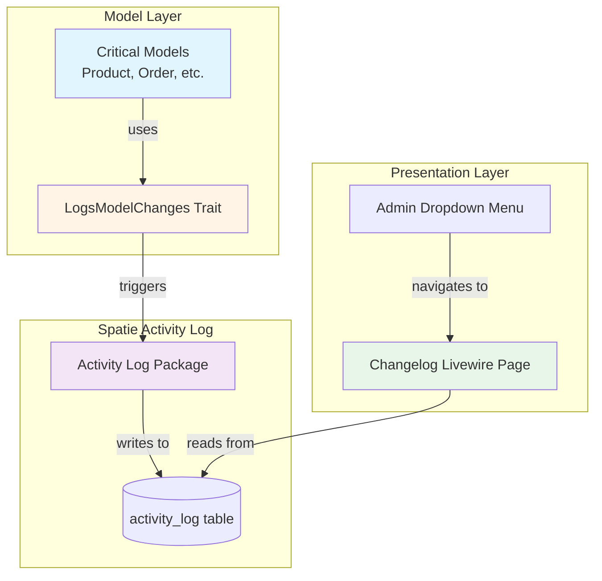
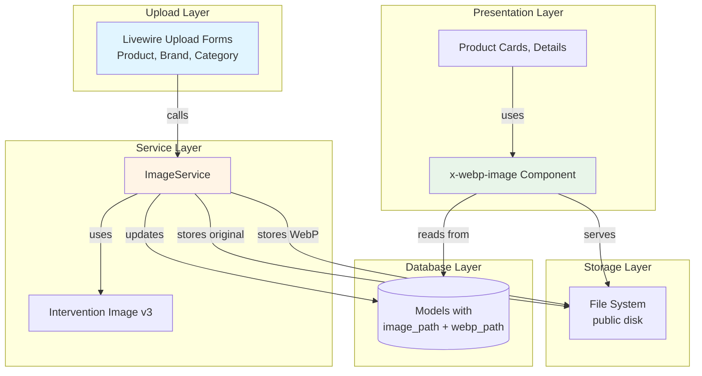

# Design Document: Model Changelog and WebP Image Conversion

## Overview

This design implements two independent platform improvements for a Laravel 12 e-commerce application:

### 1. Model Changelog Feature

An SAP-inspired audit trail system that automatically tracks changes to critical business models using the Spatie Activity Log package. The system provides a reusable trait-based approach for enabling changelog tracking on any model, with dedicated Livewire 4 changelog pages accessible from admin action dropdowns.

**Key Capabilities:**

- Automatic tracking of field changes for Product, ProductVariant, Order, Quote, User, Category, and Brand models
- Captures old value, new value, timestamp, and causer (authenticated user) for each change
- 365-day retention policy for audit compliance
- Extensible trait-based architecture for adding changelog tracking to new models
- Dedicated changelog pages with pagination and chronological display

### 2. WebP Image Conversion Feature

Automatic WebP image generation at upload time using Intervention Image v3, storing both original and WebP formats with graceful fallback support for legacy images and non-supporting browsers.

**Key Capabilities:**

- Dual storage of original and WebP formats (85% quality)
- Reusable ImageService for consistent image handling across all upload forms
- Reusable Blade component (x-webp-image) with automatic fallback
- Backward compatibility with legacy images (no WebP variant)
- Browser compatibility through HTML5 picture element

**Technology Stack:**

- Laravel 12
- Livewire 4 (anonymous class components)
- Spatie Activity Log 4.12 (already installed)
- Intervention Image v3 with GD driver (requires installation)
- Flux UI components
- PHP 8.2+

## Architecture

### Model Changelog Architecture



**Design Decisions:**

1. **Trait-Based Approach**: Using a reusable `LogsModelChanges` trait provides consistency and reduces code duplication across models
2. **Spatie Activity Log**: Leveraging an established package reduces maintenance burden and provides battle-tested functionality
3. **Selective Field Tracking**: Only tracking business-critical fields reduces database growth and improves query performance
4. **365-Day Retention**: Balances audit compliance needs with database size management

### WebP Conversion Architecture



**Design Decisions:**

1. **Service Layer Pattern**: Centralizing image handling in `ImageService` ensures consistent behavior across all upload forms
2. **Dual Storage**: Storing both formats allows graceful fallback for legacy images and non-supporting browsers
3. **85% Quality**: Balances file size reduction with visual quality based on industry best practices
4. **Picture Element**: Using HTML5 `<picture>` provides native browser-level format selection
5. **Nullable WebP Columns**: Allows backward compatibility with existing images without requiring migration

## Components and Interfaces

### Model Changelog Components

#### 1. LogsModelChanges Trait

**Location:** `app/Concerns/LogsModelChanges.php`

**Purpose:** Reusable trait that configures Spatie Activity Log for model change tracking

**Interface:**

```php
trait LogsModelChanges
{
    /**
     * Returns array of field names to track
     * Must be implemented by using model
     */
    abstract protected function getLoggedAttributes(): array;

    /**
     * Returns log category name
     * Default: lowercase class name
     */
    protected function getLogName(): string;

    /**
     * Configures activity log options
     * Called automatically by Spatie
     */
    public function getActivitylogOptions(): LogOptions;
}
```

**Usage Example:**

```php
class Product extends Model
{
    use LogsModelChanges;

    protected function getLoggedAttributes(): array
    {
        return ['name', 'price', 'sale_price', 'sku', 'stock_quantity',
                'is_active', 'status', 'category_id', 'brand_id'];
    }
}
```

#### 2. Changelog Livewire Page

**Location:** `resources/views/livewire/admin/changelog/[model]-changelog.blade.php`

**Purpose:** Anonymous Livewire 4 component that displays change history for a model instance

**Component Structure:**

```php
new class extends Component {
    public Model $model;  // The model instance being tracked

    public function mount(int $id): void;

    #[Computed]
    public function activities(): LengthAwarePaginator;

    public function render(): View;
}
```

**Display Format:**

- Reverse chronological order (newest first)
- 20 entries per page
- Each entry shows: timestamp, causer name, field changes
- Field changes show: field name, old value → new value
- "—" displayed for null/missing values

#### 3. Admin Dropdown Integration

**Location:** Various admin listing pages (products, orders, quotes, users, categories, brands)

**Integration Pattern:**

```blade
<flux:dropdown.item icon="clock" icon-variant="outline" separator
    href="{{ route('admin.changelog.product', $product) }}">
    Change Log
</flux:dropdown.item>
```

### WebP Conversion Components

#### 1. ImageService

**Location:** `app/Services/ImageService.php`

**Purpose:** Centralized service for handling image uploads with automatic WebP conversion

**Interface:**

```php
class ImageService
{
    /**
     * Store image and generate WebP variant
     *
     * @param TemporaryUploadedFile $file
     * @param string $directory Storage directory path
     * @param string $disk Storage disk name (default: 'public')
     * @return array ['original' => string, 'webp' => string]
     */
    public function storeWithWebP(
        TemporaryUploadedFile $file,
        string $directory,
        string $disk = 'public'
    ): array;

    /**
     * Generate WebP variant from existing image
     *
     * @param string $originalPath
     * @param string $disk
     * @return string|null WebP path or null on failure
     */
    public function generateWebP(
        string $originalPath,
        string $disk = 'public'
    ): ?string;
}
```

**Implementation Details:**

- Uses Intervention Image v3 with GD driver
- WebP quality: 85%
- WebP filename: `{original_name}.webp`
- Stored in same directory as original
- Returns both paths for database storage

#### 2. x-webp-image Blade Component

**Location:** `resources/views/components/webp-image.blade.php`

**Purpose:** Reusable component for rendering images with WebP support and fallback

**Interface:**

```blade
<x-webp-image
    src="{{ $product->image_url }}"
    webp="{{ $product->webp_image_url }}"
    alt="{{ $product->name }}"
    class="w-full h-full object-contain"
    loading="lazy"
/>
```

**Component Props:**

- `src` (required): Original image URL
- `webp` (optional): WebP variant URL
- `alt` (required): Alt text for accessibility
- `class` (optional): CSS classes
- Additional attributes merged onto `` element

**Rendering Logic:**

```blade
@if($webp)
    <picture {{ $attributes }}>
        <source srcset="{{ $webp }}" type="image/webp">
        merge(['class' => $class]) }}>
    </picture>
@else
    merge(['class' => $class]) }}>
@endif
```

#### 3. Model Accessors

**Purpose:** Provide convenient access to WebP URLs from models

**Implementation Pattern:**

```php
// Product model
protected function webpImageUrl(): Attribute
{
    return Attribute::make(
        get: fn() => $this->image_webp
            ? asset('storage/' . $this->image_webp)
            : null,
    );
}

// ProductImage model
protected function webpUrl(): Attribute
{
    return Attribute::make(
        get: fn() => $this->webp_path
            ? asset('storage/' . $this->webp_path)
            : null,
    );
}
```

## Data Models

### Model Changelog Data Models

#### Activity Log Table (Existing)

**Table:** `activity_log`

**Schema:**

```sql
CREATE TABLE activity_log (
    id BIGINT UNSIGNED PRIMARY KEY AUTO_INCREMENT,
    log_name VARCHAR(255),
    description TEXT,
    subject_type VARCHAR(255),
    subject_id BIGINT UNSIGNED,
    causer_type VARCHAR(255),
    causer_id BIGINT UNSIGNED,
    properties JSON,
    event VARCHAR(255),
    batch_uuid CHAR(36),
    created_at TIMESTAMP,
    updated_at TIMESTAMP,

    INDEX idx_subject (subject_type, subject_id),
    INDEX idx_causer (causer_type, causer_id),
    INDEX idx_log_name (log_name)
);
```

**Properties JSON Structure:**

```json
{
    "attributes": {
        "field_name": "new_value"
    },
    "old": {
        "field_name": "old_value"
    }
}
```

**Key Fields:**

- `log_name`: Category identifier (e.g., "product", "order")
- `subject_type`: Model class name (e.g., "App\\Models\\Product")
- `subject_id`: Model instance ID
- `causer_type`: User model class name
- `causer_id`: User ID who made the change
- `properties`: JSON containing old and new values
- `event`: Always "updated" for our use case
- `created_at`: Timestamp of the change

### WebP Conversion Data Models

#### Database Schema Changes

**Products Table:**

```sql
ALTER TABLE products
ADD COLUMN image_webp VARCHAR(255) NULL AFTER image_path;
```

**Product Images Table:**

```sql
ALTER TABLE product_images
ADD COLUMN webp_path VARCHAR(255) NULL AFTER image_path;
```

**Brands Table:**

```sql
ALTER TABLE brands
ADD COLUMN logo_webp VARCHAR(255) NULL AFTER logo_path;
```

**Categories Table:**

```sql
ALTER TABLE categories
ADD COLUMN image_webp VARCHAR(255) NULL AFTER image_path,
ADD COLUMN icon_webp VARCHAR(255) NULL AFTER icon_path;
```

**Column Specifications:**

- Type: `VARCHAR(255)` (matches original path columns)
- Nullable: `YES` (allows backward compatibility)
- Default: `NULL`
- Stores relative path from storage root (e.g., `products/image.webp`)

#### Model Fillable Arrays

```php
// Product model
protected $fillable = [
    // ... existing fields
    'image_path',
    'image_webp',
];

// ProductImage model
protected $fillable = [
    'image_path',
    'webp_path',
    // ... other fields
];

// Brand model
protected $fillable = [
    'logo_path',
    'logo_webp',
    // ... other fields
];

// Category model
protected $fillable = [
    'image_path',
    'image_webp',
    'icon_path',
    'icon_webp',
    // ... other fields
];
```

## Testing Strategy

### Property-Based Testing Applicability Assessment

**Model Changelog Feature:**

- **Assessment**: NOT suitable for property-based testing
- **Reasoning**:
    - Tests external service behavior (Spatie Activity Log package)
    - Logging behavior is deterministic and doesn't vary meaningfully with input
    - Database I/O operations with external dependencies
    - Configuration and integration testing is more appropriate
- **Alternative Strategy**: Integration tests with example-based scenarios

**WebP Image Conversion Feature:**

- **Assessment**: PARTIALLY suitable for property-based testing
- **Reasoning**:
    - Image conversion logic (ImageService) has testable properties
    - File I/O and storage operations are not suitable for PBT
    - Component rendering is deterministic
- **Alternative Strategy**: Mix of property tests for pure logic and integration tests for I/O

**Conclusion**: This feature spec does NOT require a Correctness Properties section. The features involve infrastructure configuration, external service integration, and side-effect operations that are better tested through example-based unit tests and integration tests.

### Testing Approach

#### Model Changelog Testing

**Unit Tests:**

1. **LogsModelChanges Trait Tests**
    - Test `getLoggedAttributes()` returns correct field array
    - Test `getLogName()` returns correct log category
    - Test `getActivitylogOptions()` configures correct options

2. **Model Integration Tests**
    - Test updating tracked field creates activity log entry
    - Test updating non-tracked field does NOT create entry
    - Test activity log captures old and new values correctly
    - Test activity log captures causer information
    - Test multiple field changes in single update

**Integration Tests:**

1. **Changelog Page Tests**
    - Test page displays activities in reverse chronological order
    - Test pagination works correctly (20 per page)
    - Test field changes display correctly (old → new)
    - Test null values display as "—"
    - Test authorization prevents unauthorized access

2. **Admin Dropdown Tests**
    - Test "Change Log" menu item appears in dropdowns
    - Test menu item links to correct changelog page
    - Test menu item uses correct icon

**Example Test Cases:**

```php
// Unit test example
test('product model logs price changes', function () {
    $product = Product::factory()->create(['price' => 100]);

    $product->update(['price' => 150]);

    $activity = Activity::forSubject($product)->first();
    expect($activity->properties['old']['price'])->toBe(100);
    expect($activity->properties['attributes']['price'])->toBe(150);
});

// Integration test example
test('changelog page displays product changes', function () {
    $product = Product::factory()->create();
    $product->update(['name' => 'Updated Name']);

    $this->actingAs(User::factory()->admin()->create())
        ->get(route('admin.changelog.product', $product))
        ->assertSee('Updated Name')
        ->assertSee('name');
});
```

#### WebP Conversion Testing

**Unit Tests:**

1. **ImageService Tests**
    - Test `storeWithWebP()` returns both original and WebP paths
    - Test WebP file is created with correct extension
    - Test WebP file is stored in same directory as original
    - Test `generateWebP()` creates WebP from existing image
    - Test service handles invalid image gracefully

2. **Model Accessor Tests**
    - Test `webp_image_url` returns correct URL when webp path exists
    - Test `webp_image_url` returns null when webp path is null
    - Test accessors work for all models (Product, Brand, Category, ProductImage)

**Integration Tests:**

1. **Upload Form Tests**
    - Test product image upload stores both formats
    - Test brand logo upload stores both formats
    - Test category image/icon upload stores both formats
    - Test database columns are updated correctly

2. **Component Tests**
    - Test x-webp-image renders picture element when webp provided
    - Test x-webp-image renders img element when webp is null
    - Test component merges attributes correctly
    - Test component handles legacy images (no webp)

**Example Test Cases:**

```php
// Unit test example
test('ImageService creates WebP variant', function () {
    $file = UploadedFile::fake()->image('test.jpg');
    $service = new ImageService();

    $result = $service->storeWithWebP($file, 'products');

    expect($result)->toHaveKeys(['original', 'webp']);
    expect($result['webp'])->toEndWith('.webp');
    Storage::disk('public')->assertExists($result['original']);
    Storage::disk('public')->assertExists($result['webp']);
});

// Integration test example
test('product form stores WebP variant', function () {
    $admin = User::factory()->admin()->create();
    $file = UploadedFile::fake()->image('product.jpg');

    $this->actingAs($admin)
        ->post(route('admin.products.store'), [
            'name' => 'Test Product',
            'image_path' => $file,
            // ... other fields
        ]);

    $product = Product::latest()->first();
    expect($product->image_path)->not->toBeNull();
    expect($product->image_webp)->not->toBeNull();
    expect($product->image_webp)->toEndWith('.webp');
});
```

### Test Coverage Goals

**Model Changelog:**

- Trait configuration: 100%
- Activity log creation: 100%
- Changelog page rendering: 90%+
- Authorization: 100%

**WebP Conversion:**

- ImageService logic: 100%
- Model accessors: 100%
- Upload form integration: 90%+
- Component rendering: 90%+

### Testing Tools

- **PHPUnit/Pest**: Primary testing framework
- **Laravel Testing Helpers**: Database factories, HTTP testing
- **Storage Fake**: For testing file uploads without actual I/O
- **Activity Log Assertions**: Custom assertions for activity log entries

## Error Handling

### Model Changelog Error Handling

#### 1. Activity Log Disabled

**Scenario:** `ACTIVITY_LOGGER_ENABLED=false` in environment

**Handling:**

- Spatie package automatically skips logging
- No errors thrown
- Application continues normally
- Changelog pages show empty state

**User Experience:**

```blade
@if($activities->isEmpty())
    <flux:card>
        <p class="text-zinc-500">No changes recorded for this item.</p>
    </flux:card>
@endif
```

#### 2. Missing Causer (System Changes)

**Scenario:** Model updated without authenticated user (e.g., console commands, jobs)

**Handling:**

- Activity log records with `causer_id = null`
- Changelog page displays "System" as causer

**Implementation:**

```php
// In changelog page
$causerName = $activity->causer?->name ?? 'System';
```

#### 3. Deleted Causer

**Scenario:** User who made change has been deleted

**Handling:**

- Activity log retains `causer_id` but relationship returns null
- Changelog page displays "Deleted User" or user ID

**Implementation:**

```php
$causerName = $activity->causer?->name ?? "User #{$activity->causer_id}";
```

#### 4. Invalid Model Instance

**Scenario:** Accessing changelog for non-existent model ID

**Handling:**

- Laravel throws `ModelNotFoundException`
- Caught by global exception handler
- Returns 404 response

**Route Configuration:**

```php
Route::get('/admin/changelog/product/{product}', ChangelogPage::class)
    ->name('admin.changelog.product');
// Laravel automatically handles model binding and 404
```

#### 5. Unauthorized Access

**Scenario:** User without permission tries to access changelog

**Handling:**

- Authorization check in component `mount()` method
- Throws `AuthorizationException`
- Returns 403 response

**Implementation:**

```php
public function mount(int $id): void
{
    $this->model = Product::findOrFail($id);
    $this->authorize('view', $this->model);
}
```

### WebP Conversion Error Handling

#### 1. Intervention Image Not Installed

**Scenario:** Package not installed or GD driver missing

**Handling:**

- Service throws exception during instantiation
- Caught in upload form
- Falls back to storing original only
- Logs error for admin review

**Implementation:**

```php
public function storeWithWebP($file, $directory, $disk = 'public'): array
{
    try {
        $originalPath = $file->store($directory, $disk);
        $webpPath = $this->generateWebP($originalPath, $disk);

        return [
            'original' => $originalPath,
            'webp' => $webpPath,
        ];
    } catch (\Exception $e) {
        Log::error('WebP conversion failed', [
            'error' => $e->getMessage(),
            'file' => $file->getClientOriginalName(),
        ]);

        // Fallback: store original only
        return [
            'original' => $file->store($directory, $disk),
            'webp' => null,
        ];
    }
}
```

#### 2. Invalid Image File

**Scenario:** Uploaded file is corrupted or not a valid image

**Handling:**

- Intervention Image throws exception
- Caught in service method
- Returns null for WebP path
- Original upload validation still applies

**Implementation:**

```php
protected function generateWebP(string $originalPath, string $disk): ?string
{
    try {
        $fullPath = Storage::disk($disk)->path($originalPath);
        $image = ImageManager::gd()->read($fullPath);

        $webpPath = preg_replace('/\.[^.]+$/', '.webp', $originalPath);
        $webpFullPath = Storage::disk($disk)->path($webpPath);

        $image->toWebp(85)->save($webpFullPath);

        return $webpPath;
    } catch (\Exception $e) {
        Log::warning('WebP generation failed', [
            'error' => $e->getMessage(),
            'path' => $originalPath,
        ]);

        return null;
    }
}
```

#### 3. Storage Disk Full

**Scenario:** Insufficient disk space for WebP file

**Handling:**

- Storage operation throws exception
- Caught in service method
- Original file remains
- WebP path set to null
- Error logged

**User Experience:**

- Upload succeeds with original image
- Admin notification about storage issue
- WebP generation can be retried later

#### 4. Legacy Image (No WebP)

**Scenario:** Displaying image uploaded before WebP feature

**Handling:**

- Model accessor returns null for webp_url
- x-webp-image component renders plain img element
- No errors thrown
- Graceful degradation

**Implementation:**

```blade
{{-- Component automatically handles null webp --}}
<x-webp-image
    src="{{ $product->image_url }}"
    webp="{{ $product->webp_image_url }}"  {{-- null for legacy --}}
    alt="{{ $product->name }}"
/>
```

#### 5. Browser Doesn't Support WebP

**Scenario:** User's browser doesn't support WebP format

**Handling:**

- HTML5 picture element provides automatic fallback
- Browser ignores WebP source
- Falls back to original img element
- No JavaScript required

**Browser Support:**

- Modern browsers: Serve WebP (Chrome, Firefox, Edge, Safari 14+)
- Legacy browsers: Serve original format automatically
- No detection logic needed

### Error Logging Strategy

**Log Levels:**

- `error`: Critical failures (package missing, storage failure)
- `warning`: Non-critical issues (WebP generation failed but original stored)
- `info`: Successful operations with fallback (legacy image served)

**Log Context:**

```php
Log::error('WebP conversion failed', [
    'error' => $exception->getMessage(),
    'file' => $file->getClientOriginalName(),
    'directory' => $directory,
    'disk' => $disk,
    'user_id' => auth()->id(),
]);
```

**Monitoring:**

- Laravel Telescope integration for development
- Production error tracking via log aggregation
- Admin dashboard notification for repeated failures
